# DVWA | Lesson 5
## Konfigurasi

### { Upload PHP Backdoor Payload }

pada lesson 10, kami menggunakan metasploid dan backtrack.

- pertama-tama agar backtrack dan metasploit mendapat IP, buka vm -> klik kanan -> setting -> network -> pilih bridge adapter

Alamat target DVWA (metasploitable) 
`http://10.151.34.170`

Alamat penyerang (backtrack)
`http://10.151.34.160`

## Skenario

- start metasploit dan backtrack yang sudah dikonfigurasi

- buka DVWA pada firefox yang ada di backtrack
- login dengan user : admin dan password : password
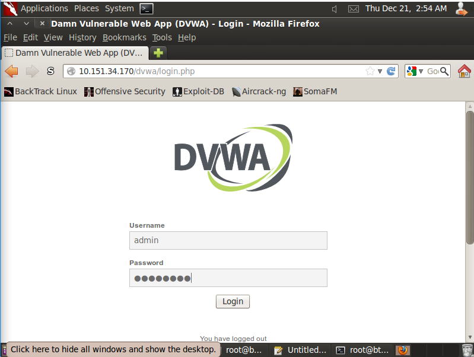
- kali ini kita akan mencoba mengganti password dengan CSRF
- masuk ke halaman CSRF

- ganti password sesuai yang diinginkan
- kami menggunakan asd123 sebagai password baru
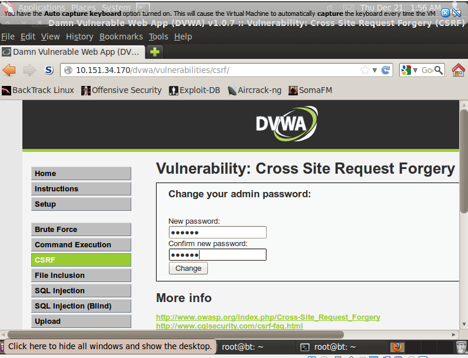
- password berhasil diubah
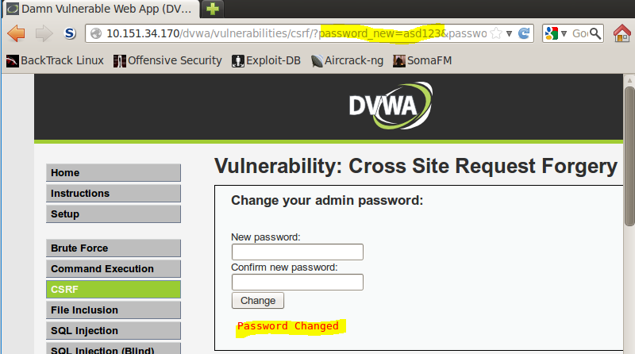
- copy url yang ada
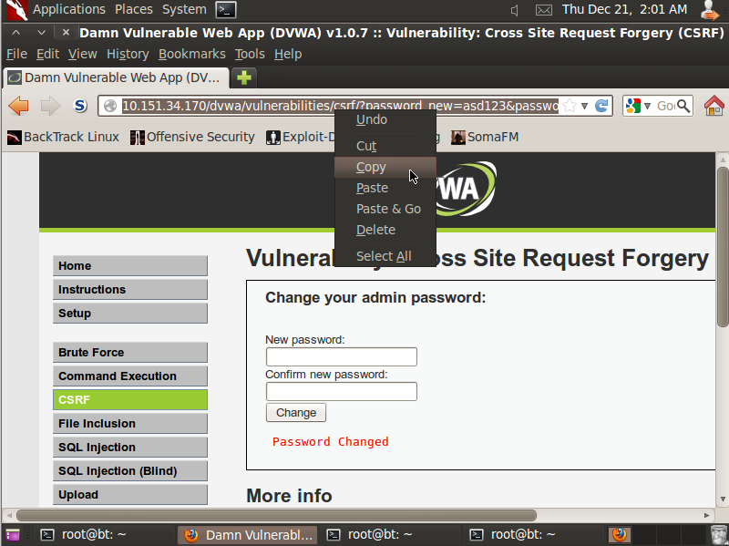
- buka notepad, dan paste url yang sudah dicopy tadi
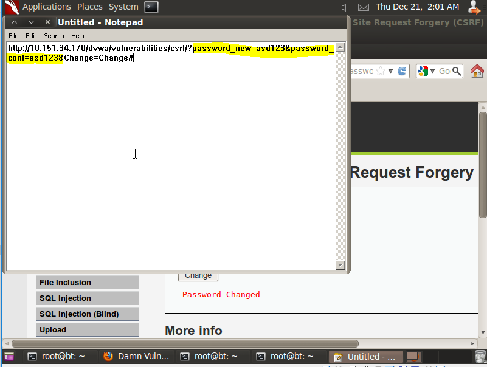
- coba logout dvwa
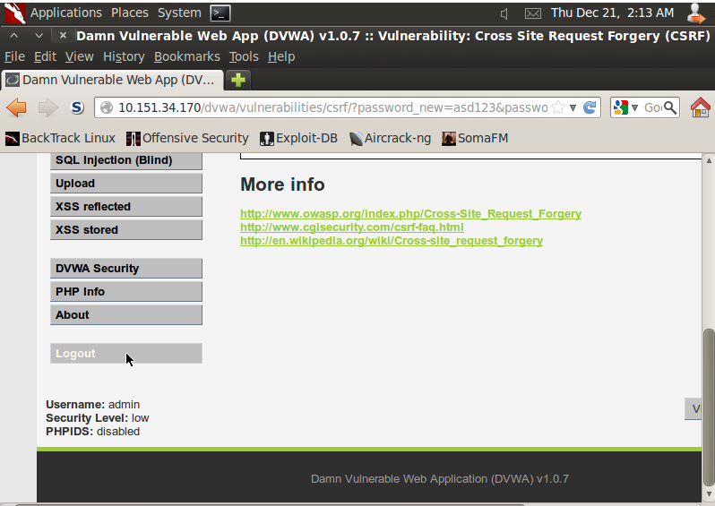
- coba login kembali menggunakan password yang sudah diubah
- kami menggunakan asd123 sebagai password baru
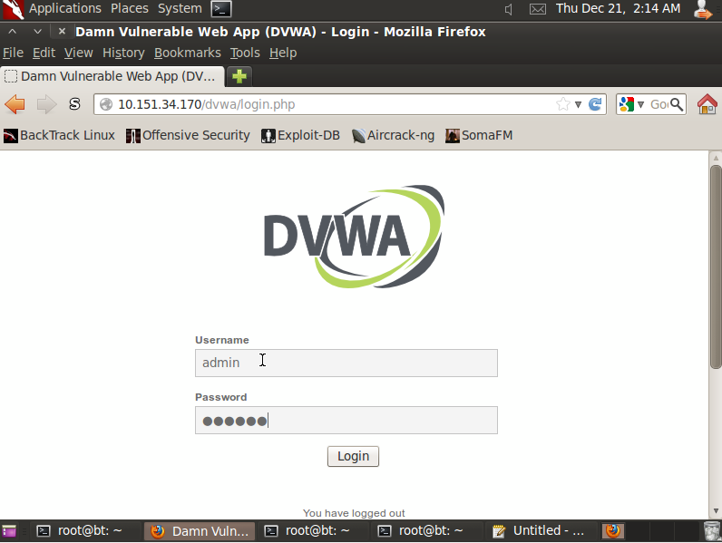
- set DVWA security menjadi low
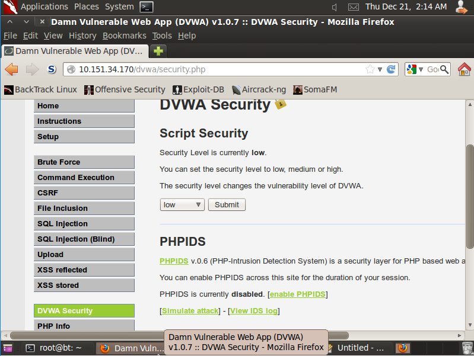
- buka halaman xss reflected
- submit cookies : 
    ``
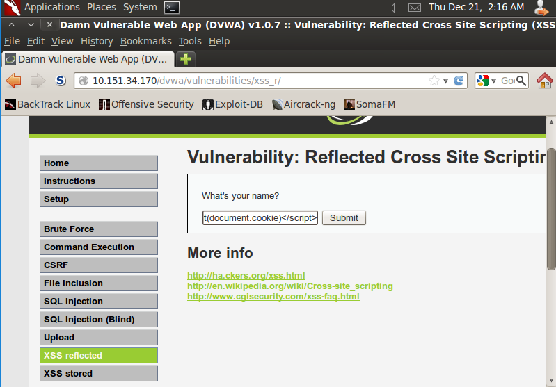
- cookies berhasil disubmit
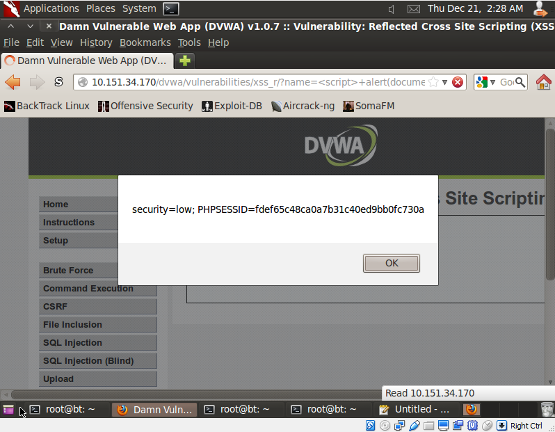
- sekarang copy hasil pop up yang ada
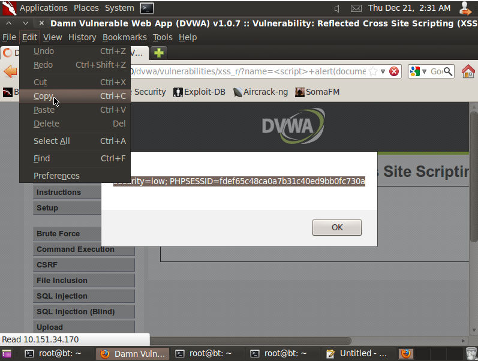
- buka notepad lagi, dan paste 
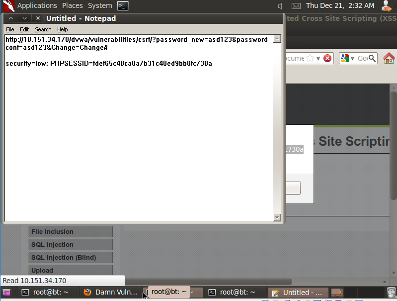
- sekarang  buatlah script baru dengan ketentuan sebagai berikut
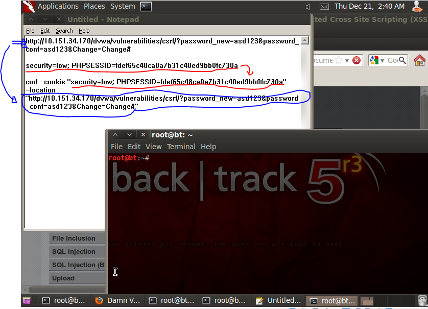
- copy dan paste script baru ke dalam terminal
- coba ganti lagi password yang ada
- jangan lupa tambahkan :
    `| grep "Password Changed" | tee curl.txt`
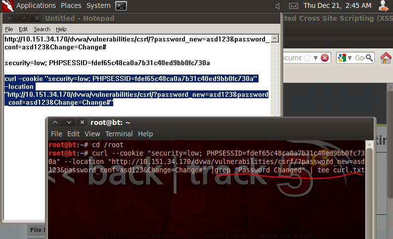

## Hasil
password berhasil diubah dengan menggunakan tee curl.txt
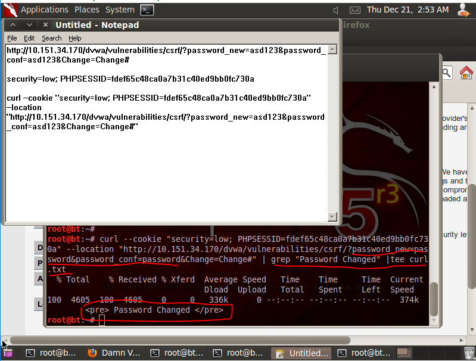

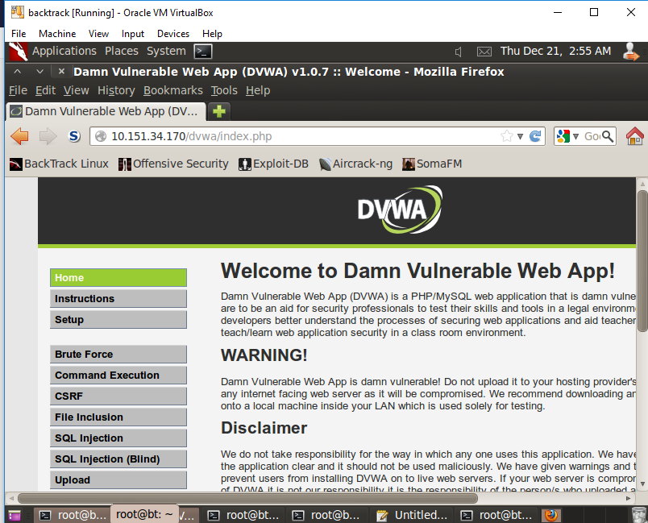