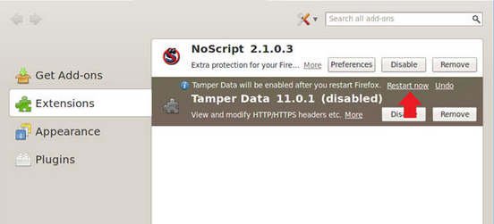
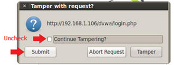
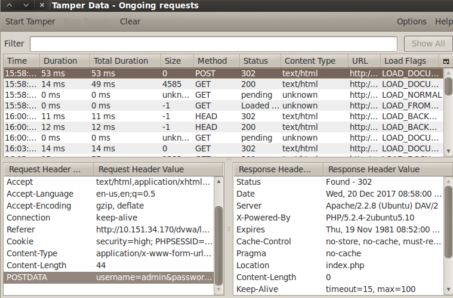
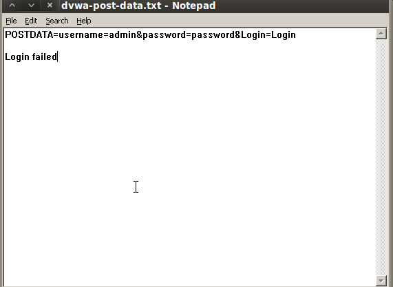
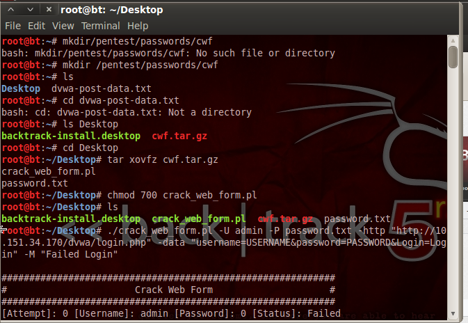
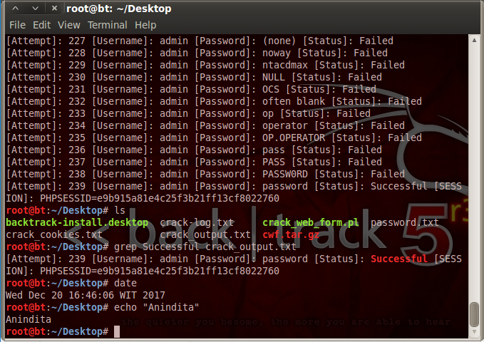
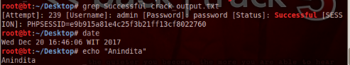

# DVWA | Lesson 5
## Konfigurasi

### Using Tamper Data with crack_web_form.pl

pada lesson 5, kami menggunakan metasploid dan backtrack.

- pertama-tama agar backtrack dan metasploit mendapat IP, buka vm -> klik kanan -> setting -> network -> pilih bridge adapter

Alamat target DVWA (metasploitable) 
`http://10.151.34.170`

Alamat penyerang (backtrack)
`http://10.151.34.160`

## Skenario

- start metasploit dan backtrack yang sudah dikonfigurasi

- log in backtrack dan metasploitable

- ketik startx pada backtrack

- pilih tools -> add ons

- pilih extensions lalu enable tamper data

- restart now

- bukalah firefox yang ada pada backtrack

- buka 10.151.34.170/dvwa/login

- klik tools -> tamper data

- start tamper

- masukan username : admin 

- masukkan password : password

- pilih 

- klik pada tulisan POST

- klik kanan pada POSTDATA yang ada dibawah -> copy

(hal ini dilakukan untuk meng copy data username dan password login)

- bukalah notes di backtrack (aplications -> wine -> programs -> accessories -> noteapad)

- paste

- logout DVWA

- lakukan login dengan password yang salah

- copy tulisan failed yang ada

- paste kembali di notes yang sama

- save file dengan nama dvwa-post-data.txt

- buka terminal, membuat konfigurasi dan running crack_web_form.pl

- mendownload 
http://www.computersecuritystudent.com/SECURITY_TOOLS/DVWA/DVWAv107/lesson5/cwf.tar.gz

- lakukan tar xowfz cwf.tar.gz untuk ekstraksi file yang telah diunduh

- ketik chmod 700 crack_web_form.pl

- `./crack_web_form.pl -U admin -P password.txt -http "http://10.151.34.170/dvwa/login.php" -data "username=admin&password=password&Login=Login" -M "Login failed"`

## Hasil
kita bisa mengcrack password 

