# DVWA | Lesson 5
## Konfigurasi

###{ Upload PHP Backdoor Payload }

pada lesson 8, kami menggunakan metasploid dan backtrack.

- pertama-tama agar backtrack dan metasploit mendapat IP, buka vm -> klik kanan -> setting -> network -> pilih bridge adapter

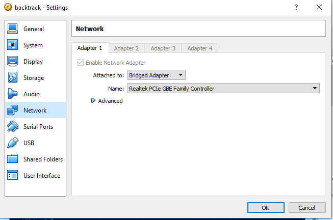
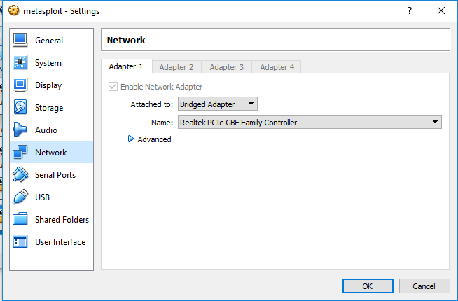

Alamat target DVWA (metasploitable) 
`http://10.151.34.170`

Alamat penyerang (backtrack)
`http://10.151.34.160`

## Skenario

- start metasploit dan backtrack yang sudah dikonfigurasi

- log in backtrack dan metasploitable
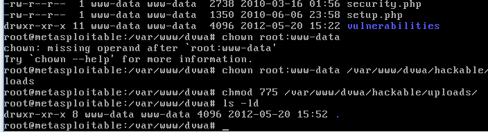
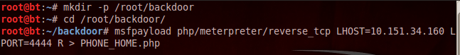
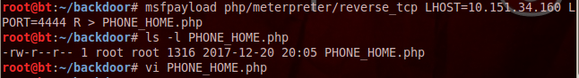
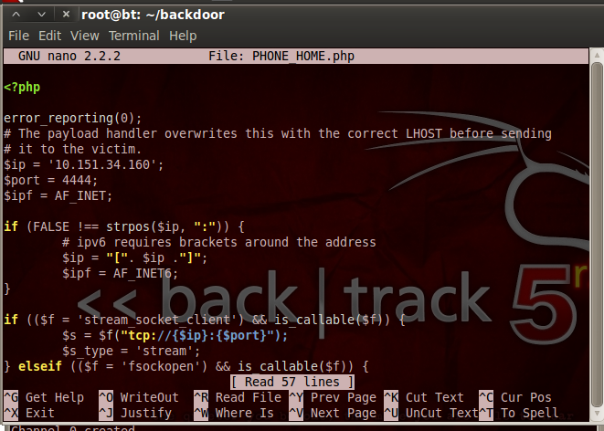
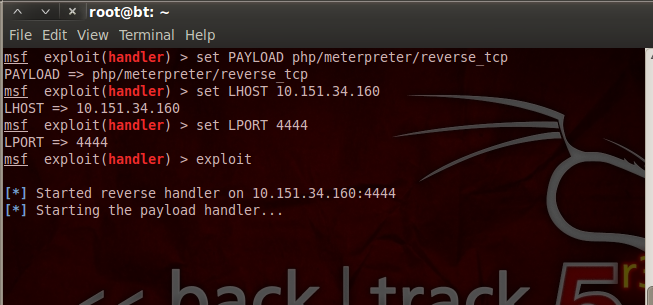
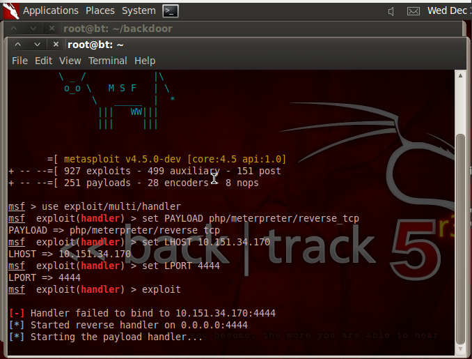
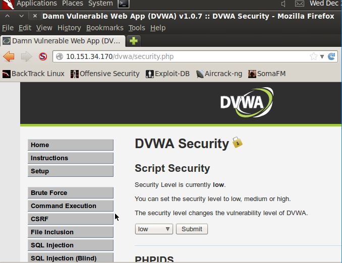
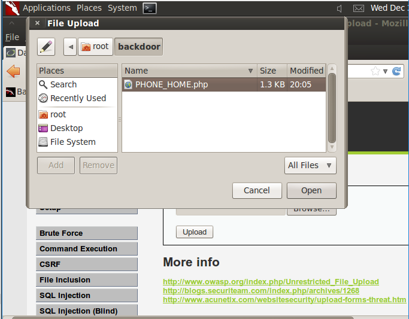
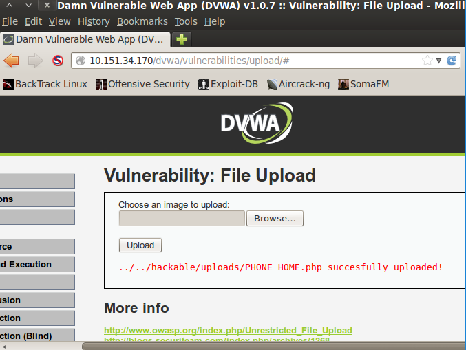
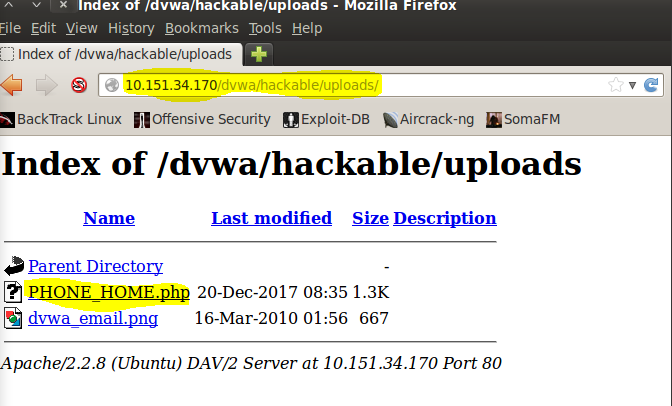
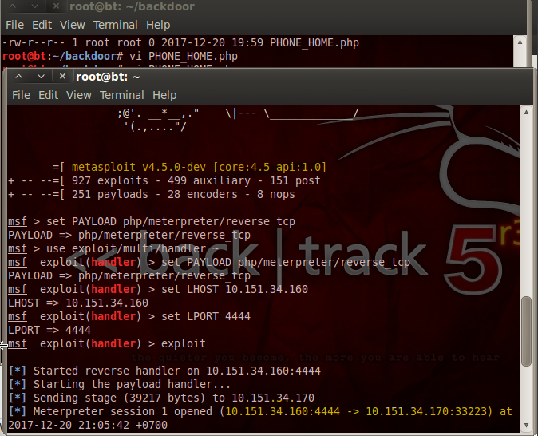
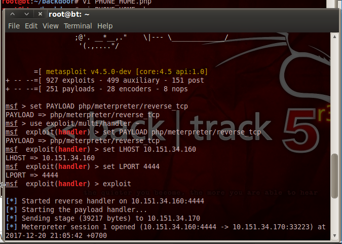
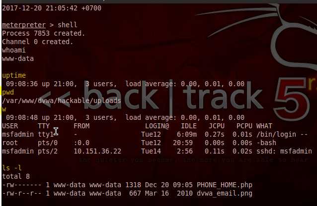
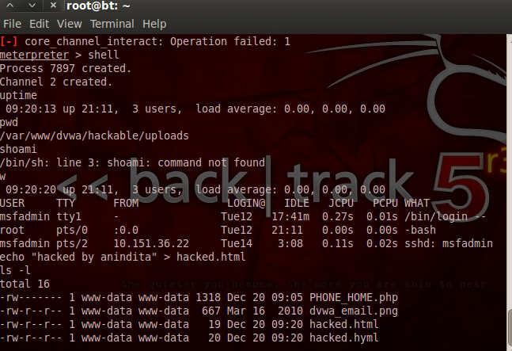
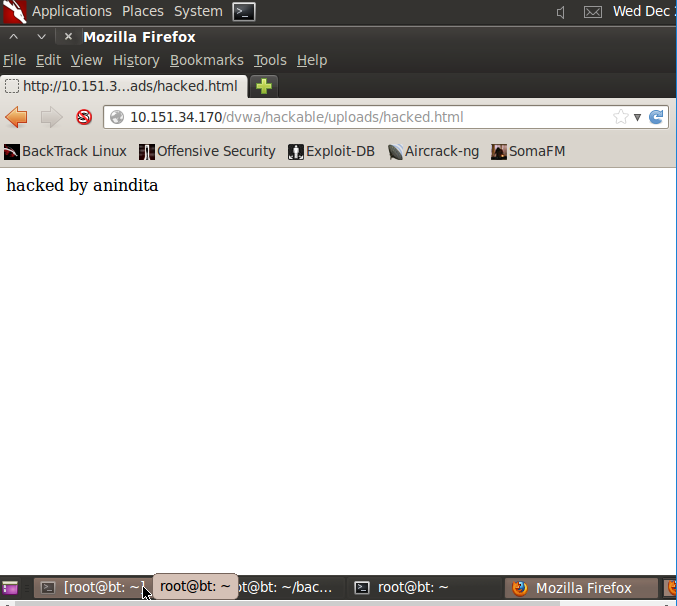

## Hasil
kita bisa mengcrack password 
