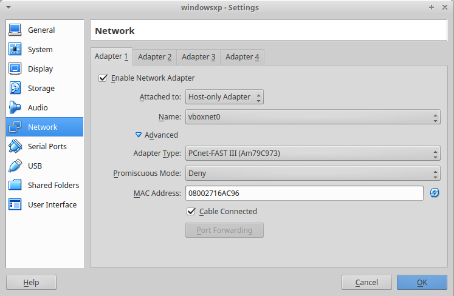
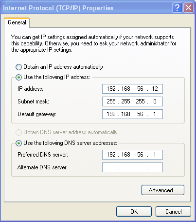
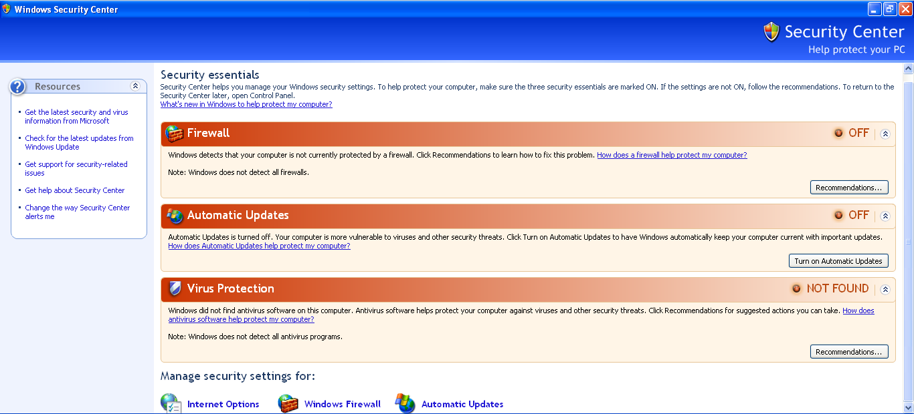
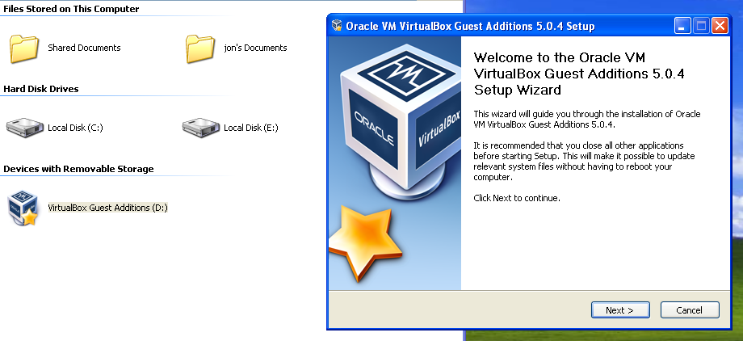
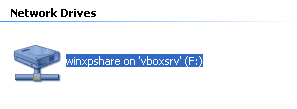
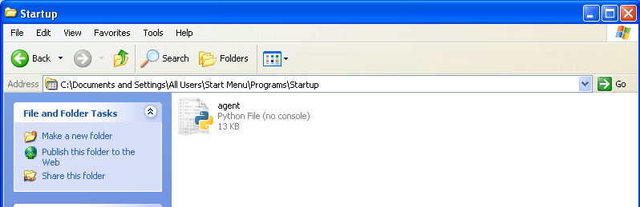

### 2.1. Pendahuluan

Cuckoo merupakan sebuah sistem _open source_ otomatis untuk analisis _malware_. Cuckoo digunakan untuk berjalan dan menganalisis _file-file_ secara otomatis, kemudian mengumpulkan hasil analisis lengkap yang menguraikan apa yang dilakukan oleh _malware_ selama berjalan di dalam sistem operasi terisolasi. Cuckoo dapat mengambil hasil dari:

* Jejak yang ditinggalkan semua proses yang ditelurkan oleh _malware_.
* _File_ yang dibuat, dihapus, dan diunduh oleh malware selama eksekusi _malware_.
* _Memory dump_ dari proses-proses _malware_.
* Jejak _network traffic_ dalam format PCAP.
* _Screenshot_ yang diambil selama eksekusi _malware_.
* Keseluruhan _memory dump_ dari mesin.

### 2.2. Instalasi

Dengan _host_ Ubuntu 16.04, paket-paket yang perlu diinstal:
```
$ sudo apt-get install git mongodb libffi-dev libjpeg-dev zlib1g-dev build-essential python-django python python-dev python-pip python-pil python-sqlalchemy python-bson python-dpkt python-jinja2 python-magic python-pymongo python-gridfs python-libvirt python-bottle python-pefile python-chardet tcpdump apparmor-utils autoconf libtool libjansson-dev libmagic-dev libssl-dev swig -y
```

#### 2.2.1. Yara

```
$ wget https://github.com/plusvic/yara/archive/v3.4.0.tar.gz -O yara-3.4.0.tar.gz
$ tar -zxf yara-3.4.0.tar.gz
$ cd yara-3.4.0
$ ./bootstrap.sh
$ ./configure --with-crypto --enable-cuckoo --enable-magic
$ make
$ sudo make install
```

Kemudian _build_ dan _install_ ekstensi **yara-python**:
```
$ cd yara-python
$ python setup.py build
$ sudo python setup.py install
```

#### 2.2.2. Pydeep

Untuk instalasi **pydeep**, perlu juga _install_ **ssdeep 2.8+**, maka:
```
$ wget http://sourceforge.net/projects/ssdeep/files/ssdeep-2.13/ssdeep-2.13.tar.gz/download -O ssdeep-2.13.tar.gz
$ tar -zxf ssdeep-2.13.tar.gz
$ cd ssdeep-2.13
$ ./configure
$ make
$ sudo make install
```

Barulah instalasi **pydeep**:
```
$ pip install pydeep
```

#### 2.2.3. Volatility

Untuk instalasi **volatility**, sebelumnya perlu:
```
$ pip install openpyxl
$ pip install ujson
$ pip install pycrypto
$ pip install distorm3
$ pip install pytz 
```

Kemudian:
```
$ git clone https://github.com/volatilityfoundation/volatility.git
$ cd volatility
$ python setup.py build
$ python setup.py install
```

#### 2.2.4. VirtualBox

Untuk virtualisasinya, di sini digunakan **VirtualBox**. Maka perlu juga diinstall dengan:
```
$ sudo apt-get install vitualbox
```

#### 2.2.5. Cuckoo

Sangat disarankan melakukan instalasi **cuckoo** dalam `virtualenv`:
```
$ virtualenv venv
$ . venv/bin/activate
(venv)$ pip install -U pip setuptools
(venv)$ pip install -U cuckoo
```

### 2.3. Konfigurasi

#### 2.3.1. Tcpdump

Tcpdump normalnya membutuhkan hak sebagai root. Tapi karena Cuckoo tidak berjalan sebagai root, maka perlu dikonfigurasi:
```
$ sudo setcap cap_net_raw,cap_net_admin=eip /usr/sbin/tcpdump
$ sudo aa-disable /usr/sbin/tcpdump
```

#### 2.3.2. Cuckoo
```
$ git clone git://github.com/cuckoosandbox/cuckoo.git
```

Perlu dilakukan konfigurasi di dalam direktori `~/.cuckoo/conf` beberapa file.

**cuckoo.conf**
```
...

machinery = virtualbox

...

[resultserver]

ip = 192.168.56.1	# IP address host

port = 2042			# Dibiarkan saja kecuali ada servis lain yang berjalan pada port tsb
```

**auxiliary.conf**
```
...

[sniffer]
# Enable or disable the use of an external sniffer (tcpdump) [yes/no].
enabled = yes

# Specify the path to your local installation of tcpdump. Make sure this
# path is correct.
# You can check this using the command: whereis tcpdump
tcpdump = /usr/sbin/tcpdump

# Specify the network interface name on which tcpdump should monitor the
# traffic. Make sure the interface is active.
# The ifconfig command will show you the interface name.
interface = vboxnet0

...
```

**virtualbox.conf**
```
...

machines = windowsxp	#Nama VM guest

[windowsxp]

label = windowsxp

platform = windows

ip = 192.168.56.10		#Alamat IP VM guest

snapshot = snapshot1	#Nama snapshot (diatur di bagian 2.3.5)

...
```

#### 2.3.3. Network
```
$ sudo iptables -t nat -A POSTROUTING -o eth0 -s 192.168.56.0/24 -j MASQUERADE
$ sudo iptables -P FORWARD DROP
$ sudo iptables -A FORWARD -m state --state RELATED,ESTABLISHED -j ACCEPT
$ sudo iptables -A FORWARD -s 192.168.56.0/24 -j ACCEPT
$ sudo iptables -A FORWARD -s 192.168.56.0/24 -d 192.168.56.0/24 -j ACCEPT
$ sudo iptables -A FORWARD -j LOG
$ echo 1 | sudo tee -a /proc/sys/net/ipv4/ip_forward
$ sudo sysctl -w net.ipv4.ip_forward=1
```

#### 2.3.4. VirtualBox

Pastikan terlebih dahulu user yang digunakan untuk menjalankan **VirtualBox** sudah masuk dalam _usergroup_ `vboxusers`:
```
$ sudo usermod -a -G vboxusers [user]
```

Perlu disiapkan _file_ iso Windows XP, kemudian buat _virtual machine_ (VM) baru dengan _optical disk_ mengarah pada _file_ iso Windows XP. Untuk ukuran hardisk minimal disiapkan 4GB dan ukuran _memory_ menyesuaikan kemampuan _host_. Setelah VM dibuat, perlu dilakukan pengaturan jaringan (_network_). Adapter yang dipilih adalah `Host-only Adapter` agar nantinya jaringan komputer terisolasi pada jaringan antara _host_ dan VM, lalu dalam opsi lanjut (_advanced_) pilih Adapter Type `PCnet-FAST III`.



Jalankan VM yang telah dibuat, lalu lakukan instalasi sistem operasi Windows XP. Tidak perlu menambahkan passowrd untuk user windows. Selesai instalasi, lakukan pengaturan alamat IP statik pada _interface adapter_ yang telah disiapkan. Alamat IP untuk `Host-only Adapter` biasanya berada dalam _subnet_ 192.168.56.0/24 dengan _gateway_ 192.168.56.1 yang berada pada _host_, sehingga alamat IP VM harus berada dalam rentang _subnet_ tersebut.



Lakukan juga mematikan sekuritas sistem operasi seperti Windows Firewall, Virus Protection, dan Windows Automatic Updates.



Setelah itu matikan VM dan buat sebuah _shared folder_ karena dibutuhkan transfer file `agent.py`, installer python2.7, dan installer PIL (Python Imaging Library) for windows ke VM.

```
$ mkdir -p /home/[user]/VirtualBox\ VMs/winxpshare
$ vboxmanage sharedfolder add "windowsxp" --name "winxpshare" --hostpath /home/[user]/VirtualBox\ VMs/winxpshare --automount 
$ cp /home/[user]/cuckoo/agent/agent.py /home/[user]/VirtualBox\ VMs/winxpshare/agent.pyw
$ cp [path_to_python2.7_installer] /home/[user]/VirtualBox\ VMs/winxpshare/
$ cp [path_to_PIL_installer] /home/[user]/VirtualBox\ VMs/winxpshare/
```

Sebelum VM bisa menggunakan _shared folder_, VM harus terlebih dahulu diinstall **VirtualBoxGuestAdditions**. Jadi iso VBoxGuestAdditions harus diunduh terlebih dahulu lalu di_attach_ ke _optical disk_ VM, kemudian nyalakan VM dan lakukan instalasi.

 

Barulah setelah VM reboot, akan muncul _shared folder_ yang dimaksud.

 

Dari _shared folder_ tsb lakukan instalasi python2.7 dan PIL, dan salin file agent.pyw ke `C:\Documents and Settings\All Users\Start Menu\Programs\Startup`

 

#### 2.3.5. Snapshot
```
$ vboxmanage snapshot "windowsxp" take "snapshot1" --pause
$ vboxmanage controlvm "windowsxp" poweroff
$ vboxmanage snapshot "windowsxp" restorecurrent
```

### 2.4. Skenario

### 2.5. Hasil
