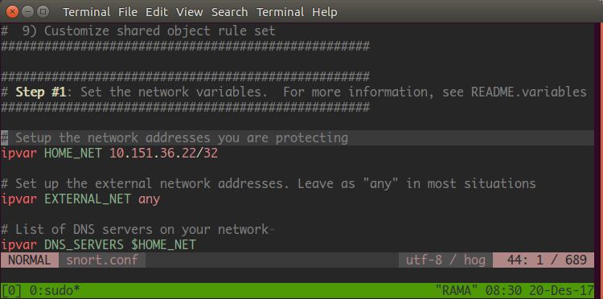
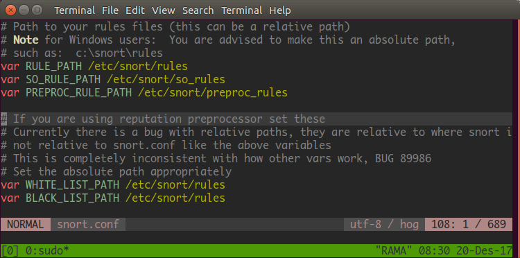

# SNORT

## Instalasi

Unduh package yang dibutuhkan
```sh
sudo apt-get install bison flex libpcap-dev libdnet-dev libdumbnet-dev
```

Unduh daq dan snort
```sh
wget https://www.snort.org/downloads/snort/daq-2.0.6.tar.gz
wget https://www.snort.org/downloads/snort/snort-2.9.11.tar.gz
```

Install daq terlebih dahulu
```sh
tar xvfz daq-2.0.6.tar.gz
                      
cd daq-2.0.6
./configure && make && sudo make install
```

Install snort
```sh
tar xvfz snort-2.9.11.tar.gz
                      
cd snort-2.9.11
./configure --enable-sourcefire && make && sudo make install
```

Buat user dan group tersendiri untuk snort agar tidak menggunakan user yang sudah ada ataupun user root.
```sh
sudo groupadd snort
sudo useradd snort -r -s /sbin/nologin -c SNORT_IDS -g snort
```

Snort tidak secara otomatis membuat direktori konfigurasi. Sekarang, membuat direktori khusus untuk konfigurasi snort
```sh
sudo mkdir -p /etc/snort/rules
sudo mkdir /var/log/snort
sudo mkdir /usr/local/lib/snort_dynamicrules
```

Ganti permission serta owner dari folder yang sudah dibuat
```sh
sudo chmod -R 5775 /etc/snort
sudo chmod -R 5775 /var/log/snort
sudo chmod -R 5775 /usr/local/lib/snort_dynamicrules
sudo chown -R snort:snort /etc/snort
sudo chown -R snort:snort /var/log/snort
sudo chown -R snort:snort /usr/local/lib/snort_dynamicrules
```

## Konfigurasi
Kali ini gunakan _community rules_ yang telah disediakan oleh komunitas snort. Download _rules_-nya terlebih dahulu.
```sh
wget https://www.snort.org/rules/community -O ~/community.tar.gz
```
Copykan rules nya ke folder `/etc/snort/rules`.
```sh
tar -xvf ~/community.tar.gz -C ~/
sudo cp ~/community-rules/* /etc/snort/rules
```

Buat direktori yang diperlukan.
```sh
sudo mkdir /etc/snort/so_rules
sudo mkdir /etc/snort/preproc_rules
```

Setelah itu, konfigurasi network dan rules agar rules bisa diterapkan pada server yang ingin diamankan. Edit file `/etc/snort/snort.conf`.
```sh
sudo vim /etc/snort/snort.conf
```

Ubah konfigurasi IP, sesuaikan dengan alamat server yang akan diamankan.


Edit direktori dengan sesuai, gunakan absolute path untuk memastikan bahwa direktori telah sesuai.


## 